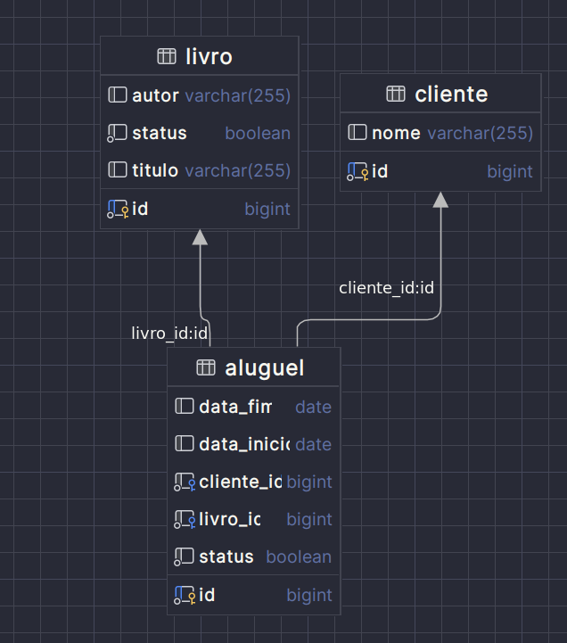

## README - Sistema de Biblioteca

Este é um projeto desenvolvido em **Java** utilizando **Spring Boot** e **PostgreSQL**. Ele fornece funcionalidades para gerenciamento de uma biblioteca, incluindo cadastro, consulta e atualização de dados.

### Pré-requisitos

Certifique-se de que as seguintes ferramentas estão instaladas em seu ambiente de desenvolvimento:

- **Java 17+**
- **Maven** (ou outro gerenciador de dependências)
- **PostgreSQL** (com um banco de dados criado)
- **IDE** (como IntelliJ IDEA, Eclipse ou Visual Studio Code)

### Configuração do Banco de Dados

Este projeto utiliza o **PostgreSQL** como banco de dados relacional.

#### Propriedades do Banco de Dados

No arquivo `application.properties`, estão configuradas as seguintes propriedades:

```properties
# Nome da aplicação
spring.application.name=biblioteca

# Configuração do banco de dados
spring.datasource.url = jdbc:postgresql://${DB_HOST}:5432/${POSTGRES_DB}
spring.datasource.username=${POSTGRES_USER}
spring.datasource.password=${POSTGRES_PASSWORD}

# jpa
spring.jpa.database-platform=org.hibernate.dialect.PostgreSQLDialect
spring.jpa.hibernate.ddl-auto=update
spring.jpa.properties.hibernate.show_sql=true
spring.jpa.properties.hibernate.format_sql=true


# Porta do servidor que será mapeado no docker/host
server.port=9090
```

### Explicação das Propriedades

- **`spring.application.name`**: Nome da aplicação, usado em logs e identificadores.
- **`spring.datasource.url`**: URL de conexão com o banco de dados PostgreSQL. A URL segue o formato `jdbc:postgresql://<host>:<porta>/<nome_do_banco>`.
- **`spring.datasource.username` e `spring.datasource.password`**: Credenciais para conexão com o banco de dados.
- **`spring.jpa.database-platform`**: Define o dialeto específico do banco de dados PostgreSQL, garantindo compatibilidade nas queries geradas pelo Hibernate.
- **`spring.jpa.hibernate.ddl-auto`**: Garante que o esquema do banco de dados seja atualizado automaticamente com base nas entidades do projeto.
- **`spring.jpa.properties.hibernate.show_sql`**: Exibe as queries SQL executadas no console.
- **`spring.jpa.properties.hibernate.format_sql`**: Formata as queries SQL para melhor legibilidade.
- **`server.port`**: Porta em que a aplicação será executada.

### Como Executar

1. Certifique-se de que o PostgreSQL está rodando e que o banco de dados `biblioteca` está criado.

2. Clone o repositório:

   ```bash
   git clone https://github.com/seu-usuario/nome-do-repositorio.git
   cd nome-do-repositorio
   ```

3. Execute o projeto com Maven:

   ```bash
   ./gradlew bootRun
   ```

4. Acesse a aplicação no navegador em: [http://localhost:8080](http://localhost:8080).

### Estrutura do Projeto

```bash
src
├── main
│   ├── java
│   │   └── com
│   │       └── exemplo
│   │           └── biblioteca
│   │               ├── controller  # Controladores da API
│   │               ├── model       # Entidades do banco de dados
│   │               ├── repository  # Interfaces de acesso ao banco
│   │               ├── service     # Lógica de negócios
│   │               └── DTO         # Transferência de dados
│   └── resources
│       ├── application.properties  # Configurações da aplicação
│       └── static                  # Arquivos estáticos
└── test
```

---
### Diagrama de Classes

---

Se precisar de mais ajustes ou detalhes, posso ajudar~


### Contribuindo usando o docker

Para contribuir com o projeto, você pode usar o docker para subir o ambiente de desenvolvimento. Para isso, siga os passos abaixo:

1.Instale o docker e o docker-compose em sua máquina.
[Instalação do Docker](https://docs.docker.com/get-docker/)
[Instalação do Compose](https://docs.docker.com/compose/install/)

2. copie o arquivo .env.example para .env e preencha as variáveis de ambiente.
```bash
cp .env.example .env
```

3. Execute o comando abaixo para subir o ambiente de desenvolvimento.
```bash
docker-compose up --build
```

4. Verifique se o container está rodando.
```bash
docker ps
```

5. Pronto! Agora você pode acessar o projeto em [http://localhost:9090](http://localhost:9090).
